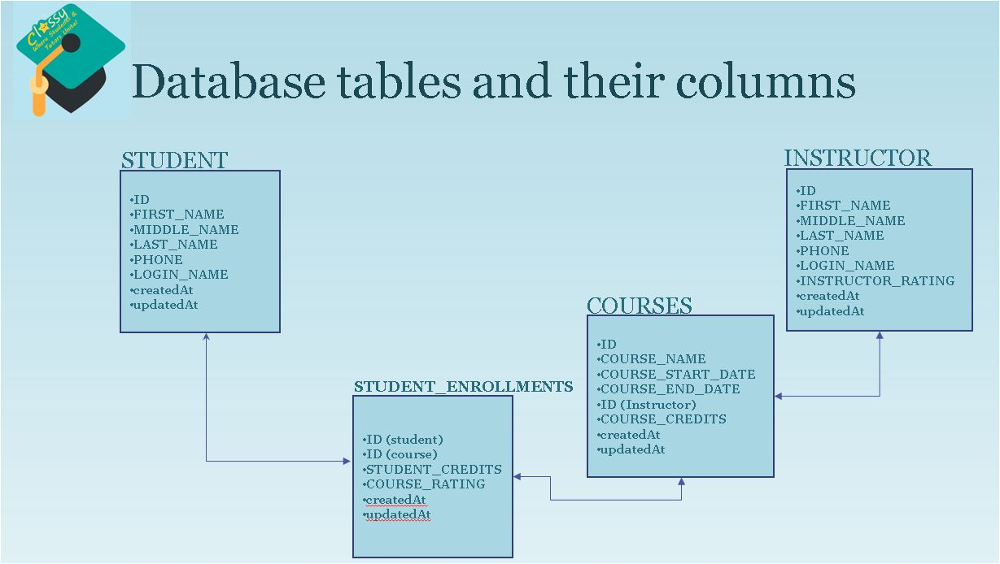
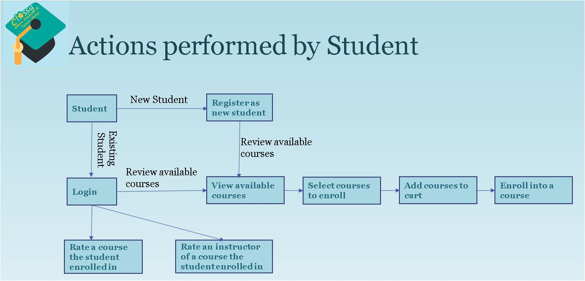
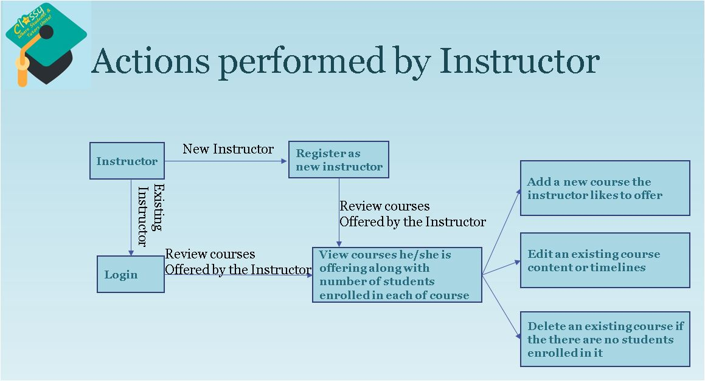
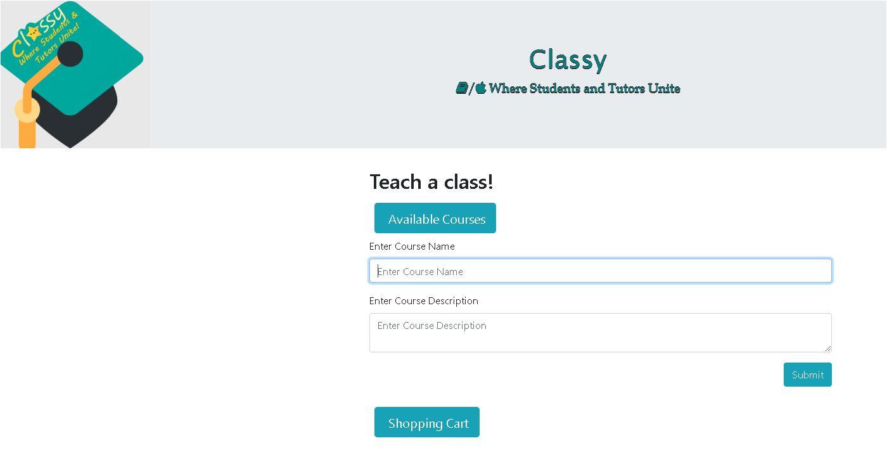

## [Link to Project](https://teamfour.herokuapp.com/)

# Classy - Where students & tutors unite

 

Classy is a typical market place web application where buy and sell takes place.
 

## Overview and flow:

<b>
This application consists of three main entities which are Students, Instructors and Courses.
</b>
 
*   Students can purchase and enroll into courses offered by Instructors and can rate each course or an instructor.
 
*   Instructors can offer new courses or edit existing courses and can decide the course credits for each offered course.
 
*   Courses have specific start and end dates, which offeres specific course credits depending on the course duration.
 
*   Depending on Students ratings for course or for the instructor, the popularity / demand grows for the course or for the instructor. Top rated courses or top rated instructors were shown on the home page.
   

 

## Database tables, columns and how the tables are connected

 

 

### Actions performed by Student

 

 

#### New Students Registration form:

To start with, students can register as new users by navigating to the "Register as a new student" button and provide the below details for registration.

- Name (first name, middle name, last name)
- Phone
- Login Name (unique name to login to the application after the registration)

If user has not provided any of the above listed fields, an error message is shown prompting the user to enter these fields.
 
A quick preview of the user registration is shown below.

### Actions performed by Instructor

 

 

#### New Instructors Registration form:

Instructors can register as new users by navigating to the "Register as a new instructor" button and provide the below details for registration.

- Name (first name, middle name, last name)
- Phone
- Login Name (unique name to login to the application after the registration)

If user has not provided any of the above listed fields, an error message is shown prompting the user to enter these fields.
 
A quick preview of the user registration is shown below.

#### Instructors adding new courses:

Instructors can add new courses by navigating to "Teach a class".
 

 

#### Technology used:

- Node and Express Web Server
- MySQL Database with a Sequelize ORM
- Handlebars for templates
- GET and POST routes for retrieving and adding new data
- Follwed MVC Paradigm
- Deployed in Heroku

 

### Original Contributors:

- Carlos De Castro
- Kiran Kesari
- Eric Pinder

### Future Development:

- Login Page to check for valid user name
- Maintain the table dependencies among (Students, Courses, Student Enrollments) and also among (Instructors, Courses, Student Enrollments)
- Instructors to have the abitlity to update and delete courses
- Students to have the abitlity to un-enroll the courses, if the courses have not started yet
- Maintain a flow, enhance the navigation reaching to each page
